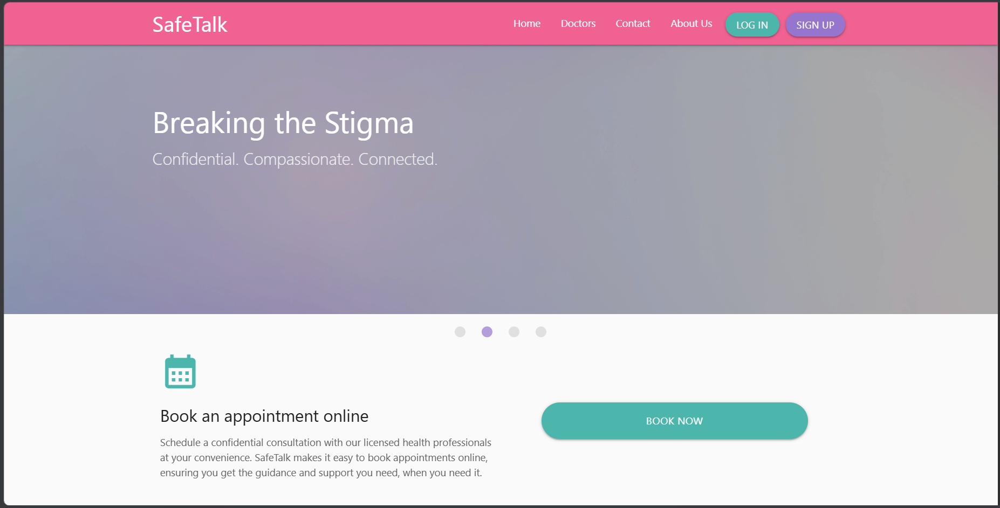

# SafeTalk: An Online Consultation Platform for Sexual Health and Education

> This web application provides a platform for individuals seeking mental or sexual health consultations. Users can sign up and create an account.
Book appointments. Pay appointments and attend consultations through chat or video call.



## 📖 Overview

This web application is created for individuals seeking mental or sexual health education. It provides a digital platform for healthcare professionals and
individuals who prefer having an online consultations. It features registration and authentication, appointment management, payment processing, and consultation
through chat or video call.

## 🚀 Live Demo

**Website:** URL is currently down

**Repository:** https://github.com/basaandrewdane-oss/safetalk-web

---

## ✨ Features

- Responsive design
- Registration and Authentication
- Appointment Management
- Payment Processing
- Mobile-friendly layout
- Chat and Video call Consultation

---

## 🛠️ Built With

### Frontend
- HTML5
- CSS3
- AngularJS 1.8
- JavaScript

### Backend (if applicable)
- .NET
- C#

### Database (if applicable)
- MySQL
- EntityFramework

### Tools
- Git
- GitHub
- Visual Studio 2022
- HeidiSQL

---

## 📂 Project Structure

```
SafeTalkApp/
|
|-- AppData/
|-- AppStart/
|-- Content/
|-- Controllers/
|-- DTOs/
|-- Hubs/
|-- ILLink/
|-- Interfaces/
|-- Models/
|-- Scripts/
|-- Services/
|-- Uploads/
|-- Views/
|-- favicon.ico
|-- Global.asax/
|-- packages.config
|-- Startup.cs
L-- Web.config
SafeTalkAppTests/
|
|-- Dependecies/
|-- Helpers/
|-- Services/
|-- MSTestSettings.cs
```

---

## Prerequisites

Before running this project, ensure you have:

- Visual Studio 2022 (or later)
- .NET SDK 4.8 above
- MySQL Server
- Git

## ⚙️ Installation

1. Clone the repository.

```bash
git clone https://github.com/basaandredane-oss/safetalk-web.git
```

2. Navigate to the project directory.

```bash
cd project-name
```

3. Open the solution file (`.sln`) in Visual Studio.

4. Restore the NuGet packages.

5. Configure the database connection string in:

```
Web.config
```


6. Apply database migrations (Entity Framework).

```powershell
Update-Database
```

7. Build and run the application.

Press **F5** or click **Start** in Visual Studio.

## 💻 Usage

1. Open the website.
2. Navigate through the menu.

---

## 🤝 Contributing

Contributions are welcome!

1. Fork the repository.
2. Create a feature branch.
3. Commit your changes.
4. Push the branch.
5. Open a Pull Request.

---

## 👤 Author

**Andrew Basa**

- GitHub: https://github.com/basaandrewdane-oss
- LinkedIn: https://linkedin.com/in/dane-basa-b8809a377
- Email: basaandrewdane@gmail.com

---
